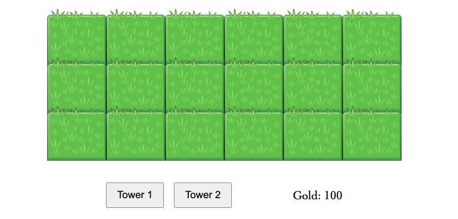
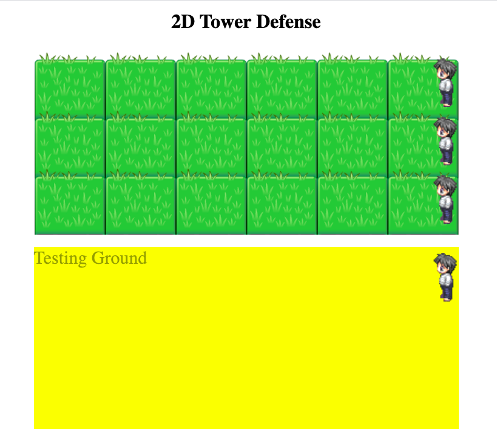

# Project One: 2D Tower Defense Game

Inspired by "Plant vs Zombie" where some enemies spawned from the right side walking to the left direction.

Game Objective:
Player need to defeat all enemies and protect their safe zone (left side) by building 2 type of auto-attacking towers.

# Project Progress:

1. Create Initial Game Screen

1. Test Summonning enemies in various spots and let them move to left direction

