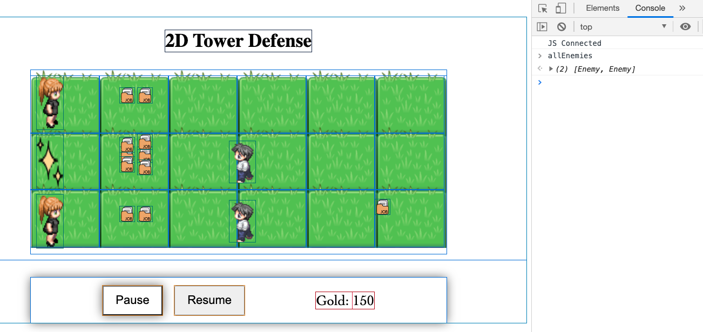

# Project One: 2D Tower Defense Game

Inspired by "Plant vs Zombie" where some enemies spawned from the right side walking to the left direction.

Game Objective:
Player need to defeat all enemies and protect their safe zone (left side) by building 2 type of auto-attacking towers.

# Project Progress

1. Create Initial Game Screen & Try summoning enemy from various spots in different interval

1. Do Major Change: Adding 'GameObject' class as a fundamental of other objects (Tower, Bullets, Enemy). Set some get dimension() to help in calculating collision

1. Test the enemy damage taken on bullets from different directions

1. Tag SmallTower with 1-bullet-shot, and BigTower with 3-bullets-shot

1. Set unique id for each 'GameObject' to help calling their index when we want to remove from main arrays

1. Test whole collision, removing enemies & bullets from array, and add +50 gold for each enemy died

1. Add the tower by clicking the button, followed by clicking the desired location. Enemy will appear in random rows and different quantity in each levels

1. Fighting against Boss - with huge health, at 3rd level

