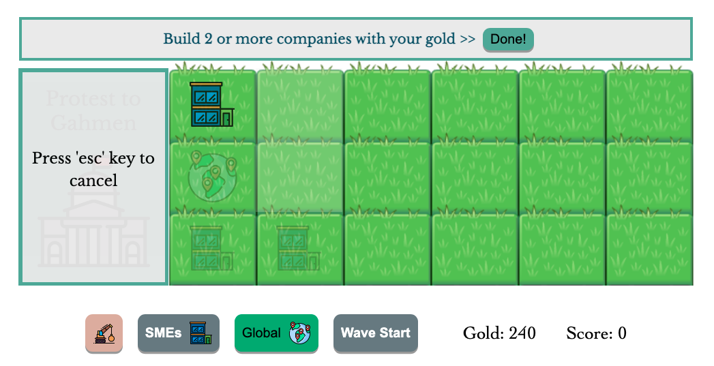
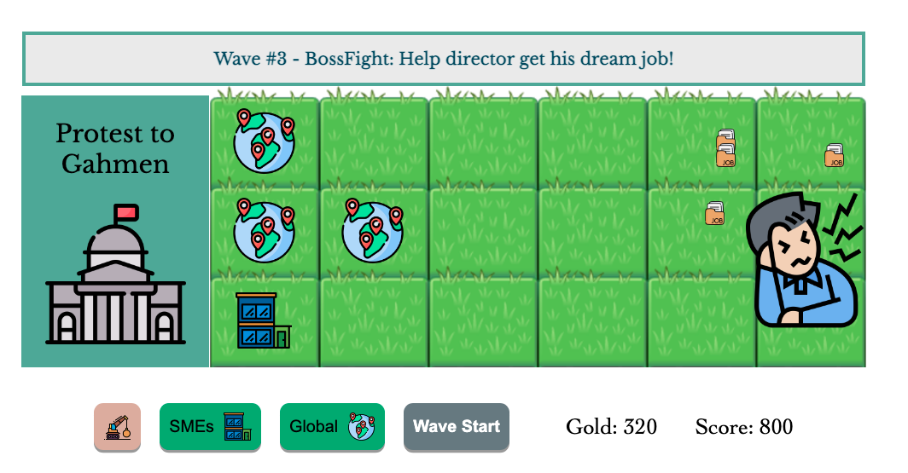

# Project One: Job Hunters

[Click for Live Demo](https://dreamy-edison-d56176.netlify.app/)

Inspired by "Plant vs Zombie", this game help all job applicants that come from everywhere to get their dream job from either SMEs or Global companies.

Game Objective:
Player build company to send job interviews to Job Applicants. Everyone have to get a job!

# How to Play

1. Build companies (SMEs is 50 Gold, and Global is 200 Gold), then press "Done"
1. Pressed "Wave Start" button to welcome job applicants
1. Companies will automaticly send job interviews
1. Demolish a tower will get 50% of cost
1. Beware: Boss Fight at level-3

# Project Features

1. Used 'GameObject' class as a fundamental of other objects (Tower, Bullets, Enemy). Set some get dimension() to help in calculating collision

1. Set unique id for each 'GameObject' to help calling their index when we want to edit/remove from main arrays

1. Test the enemy damage taken on bullets from different directions

1. Add a tower by clicking the button followed by grayed-ground. SMEs shoot 1-bullet, meanwhile Global shoot 3-bullets.

1. Enemy spawns in random rows with bullet-collisions-receptors from various directions. Enemy will generate +50 gold and +100 score

1. Fighting against Boss - with huge health, at 3rd level

